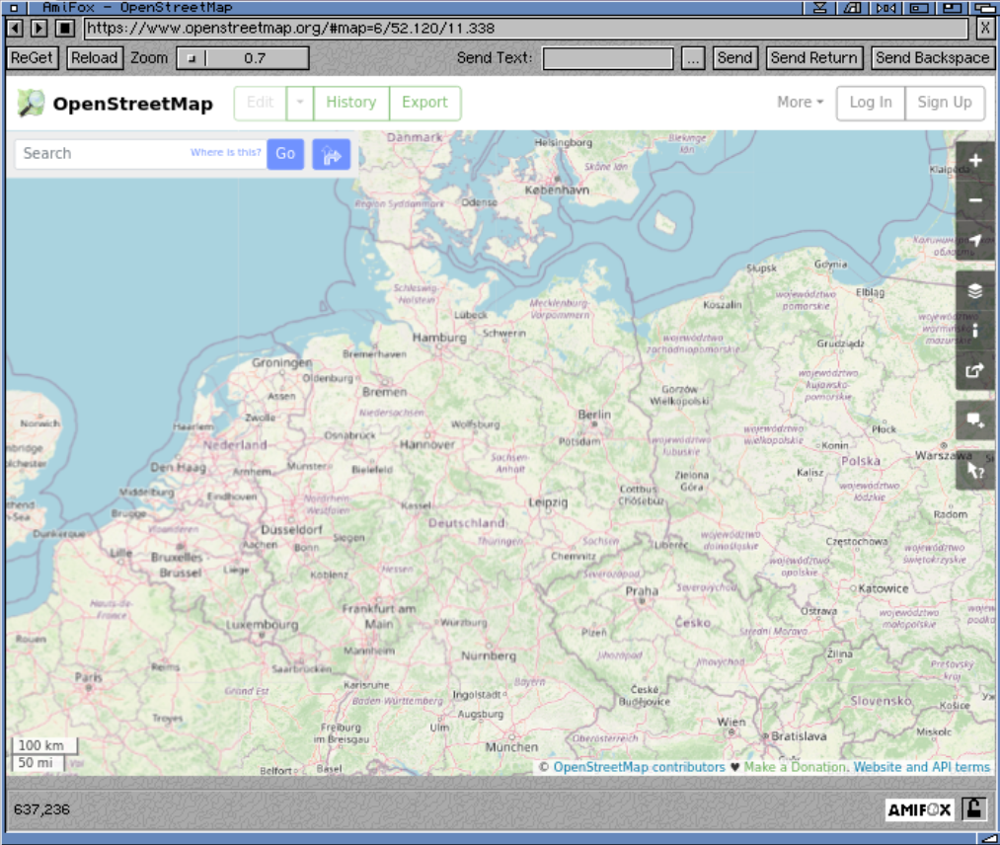

# WRP - Web Rendering Proxy
## AmiFox Server Version

A browser-in-browser "proxy" server that allows to use historical / vintage web browsers on the modern web. It works by rendering a web page in to a GIF or PNG image with clickable imagemap.



This server can be used as the original WRP in a webbrowser but works much better using the dedicated [AmiFox](https://blog.alb42.de/programs/AmiFox) app available for m68k Amiga

## Usage Instructions

* Start the WRP executable or docker container
* Add a ToolType to AmiFox WRPSERVER=name_or_ip_of_WRP:Port_of_WRP
* Add a ToolType WRPTOKEN=token if you also added a token as security, see Flag -token

## Docker

```shell
$ docker run -d -p 80:8080 alb42/amifoxserver
```

## Flags

```text
-l     listen address:port (default :8080)
-sl    TLS listen address:port (default :8081)
-t     image type gif, png or jpg (default gif)
-O     Optimize images with external tools (optipng, jpegoptim)
-g     image geometry, WxHxC, height can be 0 for unlimited (default 1152x600x216)
       C (number of colors) is only used for GIF
-q     Jpeg image quality, default 80%
-h     headless mode, hide browser window on the server (default true)
-d     chromedp debug logging (default false)
-n     do not free maps and images after use (default false)
-ui    html template file (default "wrp.html")
-s     delay/sleep after page is rendered before screenshot is taken (default 2s)
-token If set, all requests need to have this set as Bearer header
```

## Minimal Requirements

* Server/Gateway requires modern hardware and operating system that is supported by [Go language](https://github.com/golang/go/wiki/MinimumRequirements) and Chrome/Chromium Browser, which must be installed.
* Client Browser needs to support `HTML FORMs` and `ISMAP`. Typically [Mosaic 2.0](http://www.ncsa.illinois.edu/enabling/mosaic/versions) would be minimum version for forms. However ISMAP was supported since 0.6B, so if you manually enter url using `?url=...`, you can use the earlier version.

## Troubleshooting

### I can't get it to run

This program does not have a GUI and is run from the command line. You may need to enable executable bit on Unix systems, for example:

```shell
$ cd ~/Downloads
$ chmod +x wrp-amd64-macos
$ ./wrp-amd64-macos -t png
```

## History

* Version 1.0 (2014) started as a *cgi-bin* script, adaptation of `webkit2png.py` and `pcidade.py`, [blog post](https://virtuallyfun.com/2014/03/03/surfing-modern-web-with-ancient-browsers/).
* Version 2.0 became a stand alone http-proxy server, supporting both Linux and MacOS, [another post](https://virtuallyfun.com/wordpress/2014/03/11/web-rendering-proxy-update//).
* In 2016 thanks to EFF/Certbot the whole internet migrated to HTTPS/SSL/TLS and WRP largely stopped working. Python code became unmaintainable and there was no easy way to make it work on Windows, even under WSL.
* Version 3.0 (2019) has been rewritten in [Go](https://golang.org/) using [Chromedp](https://github.com/chromedp) as browser-in-browser instead of http-proxy. The initial version was [less than 100 lines of code](https://gist.github.com/tenox7/b0f03c039b0a8b67f6c1bf47e2dd0df0).
* Version 4.0 has been completely refactored to use mouse clicks via imagemap instead parsing a href nodes.
* Version 4.1 added sending keystrokes in to input boxes. You can now login to Gmail. Also now runs as a Docker container and on Cloud Run/Azure Containers.
* Version 4.5 introduces rendering whole pages in to a single tall image with client scrolling.
* Version 4.6 adds blazing fast gif encoding by [Hill Ma](https://github.com/mahiuchun).

## Credits

* Uses [chromedp](https://github.com/chromedp), thanks to [mvdan](https://github.com/mvdan) for dealing with my issues
* Uses [go-quantize](https://github.com/ericpauley/go-quantize), thanks to [ericpauley](https://github.com/ericpauley) for developing the missing go quantizer
* Thanks to Jason Stevens of [Fun With Virtualization](https://virtuallyfun.com/) for graciously hosting my rumblings
* Thanks to [claunia](https://github.com/claunia/) for help with the Python/Webkit version in the past
* Thanks to [Hill Ma](https://github.com/mahiuchun) for ultra fast gif encoding algorithm
* Historical Python/Webkit versions and prior art can be seen in [wrp-old](https://github.com/tenox7/wrp-old) repo

## Legal Stuff

License: Apache 2.0
Copyright (c) 2013-2018 Antoni Sawicki
Copyright (c) 2019-2022 Google LLC
